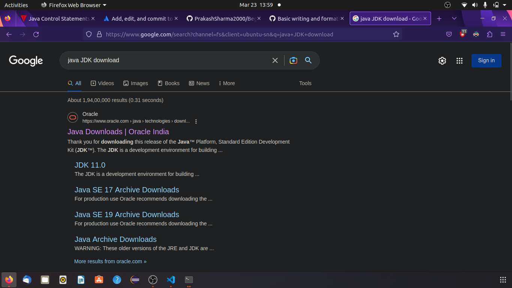
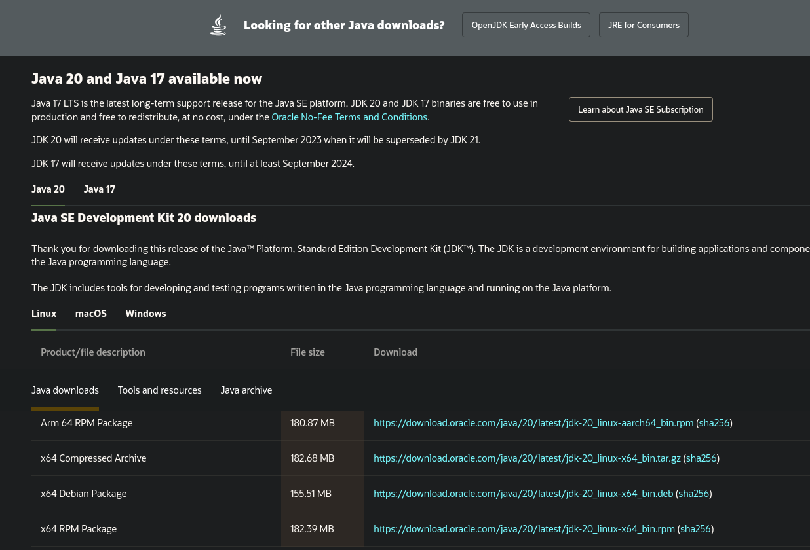
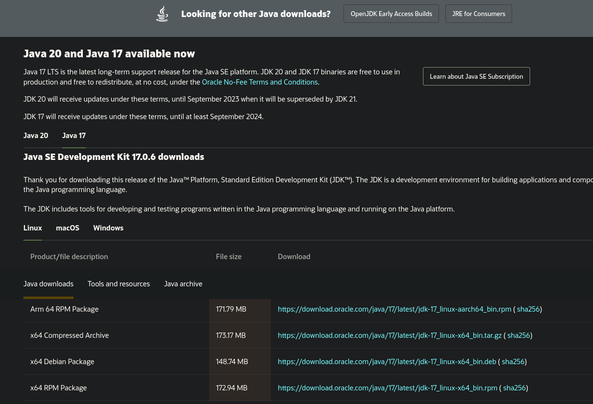
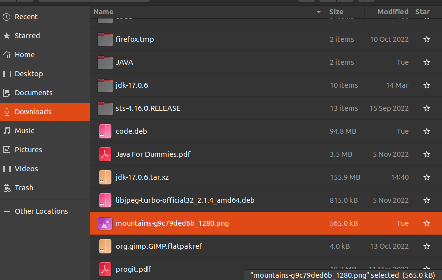
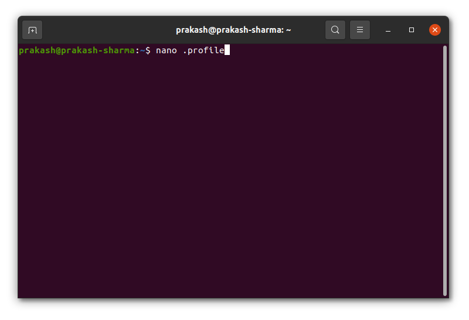
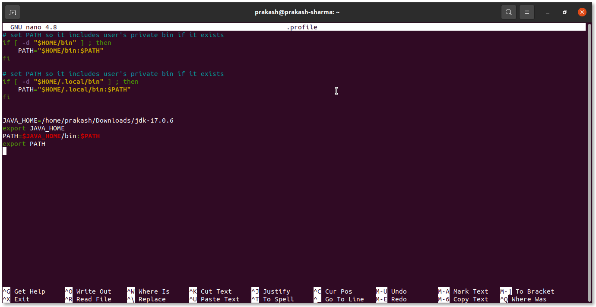

# BeginJavaChapter
This rep. is all about how to learn java.

## Setup Guide for Java JDK in Ubuntu

In this setup Guide I will guide you how to install Java version 17 in you Ubuntu Machine.

1. Open Your Browser
2. Search for java jdk Download

3. Click on first link
   - You will see something like this
   
4. Click on Java 17 


5. Download the Compressed file for linux 
>Note:- In my case It did not ask me login,if you are doing same and got prompt to login please login.
6. Now Open the download location of compressed file and extract it where every you want

>>Here I have Extracted in Downloads.
7. Now open Command prompt at desktop and write nano .profile and hit enter.
    
8. Inside the enter the following code
 ```
 JAVA_HOME="Enter The bin Path where you extracted the file"
export JAVA_HOME
PATH=$JAVA_HOME/bin:$PATH
export PATH
```


- To save press `Ctrl`+ `W` and to exit press `Ctrl`+`X`

:clinking_glasses: Congratulation you have successfully set up you Java in you Machine.
>**Note:** Restart your machine once then use.